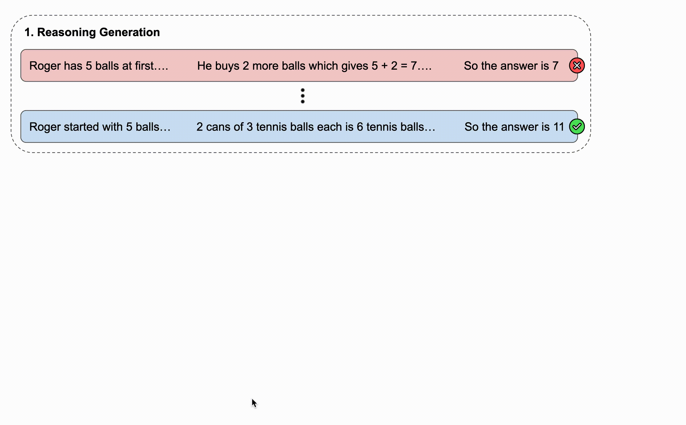
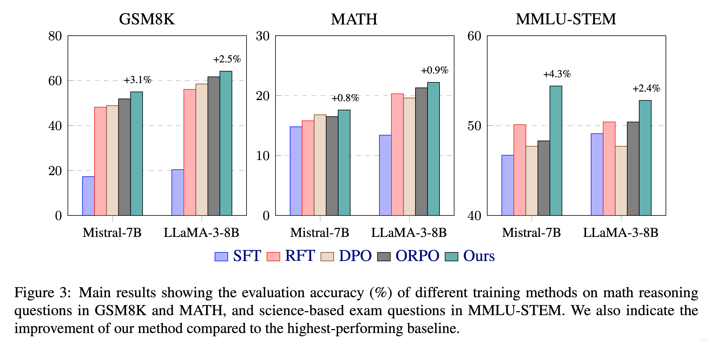

# Reasoning Paths Optimization: Learning to Reason and Explore From Diverse Paths

This is the official repo for reasoning paths optimization, a simple and effective training framework for enhancing
reasoning ability of large language models.

<div style='display:flex; gap: 0.25rem; '>
<a href='https://github.com/DAMO-NLP-SG/reasoning-paths-optimization/blob/main/LICENSE'></a>
<a href='https://reasoning-paths.github.io'></a>
<a href='https://arxiv.org/abs/2410.10858'></a>
<a href='https://twitter.com/ChiaYewKen1'></a>
</div>



## Usage

### Set up environment

```
conda create -n rpo python=3.10 -y
conda activate rpo
pip install -r requirements.txt
```

### Download models

```
huggingface-cli download mistralai/Mistral-7B-v0.1 --local-dir models/mistral
huggingface-cli download meta-llama/Meta-Llama-3-8B --local-dir models/Meta-Llama-3-8B
```

### Quick start

To run RPO end-to-end, here is an example using mistral for MMLU(STEM)

```
bash scripts/rpo_quick_start.sh python \
mmlu_stem_mistral_beta_03 \
models/mistral \
mmlu_stem \
0.3
```

Alternatively, to run reasoning generation:

```
python evaluation.py evaluate_sc \
"gsm8k" \
--demo_name "gsm8k" \
--path_model "models/mistral" \
--data_split "train"
```

To run reasoning exploration:

```
python branching.py generate_paths \
gsm8k \
gsm8k \
outputs/gsm8k_mistral.json \
--path_model models/mistral \
--data_split train \
--existing_preds_path outputs_sc/eval_data=gsm8k-demo=gsm8k-split=train-num_sample=10-path_model=models-mistral.jsonl
```

Or split the datasets into several parts to run on different GPUs in parallel:

```
python branching.py generate_paths \
gsm8k \
gsm8k \
outputs/gsm8k_mistral_part1.json \
--path_model models/mistral \
--data_split train \
--start_index START_INDEX --end_index END_INDEX \
--existing_preds_path outputs_sc/eval_data=gsm8k-demo=gsm8k-split=train-num_sample=10-path_model=models-mistral.jsonl

python branching.py merge_path_data outputs/gsm8k_mistral_part*.json --path_out outputs/gsm8k_mistral.json
```

To run reasoning optimization:

```
bash scripts/train_reason_paths.sh python \
outputs/gsm8k_mistral.json \
gsm8k_mistral_beta_03_rpo \
models/mistral \
gsm8k \
0.3
```

## Results

- RPO demonstrates consistent benefits across math and science reasoning tasks.



## Citation

If you find this work useful, please cite:

```
@article{damonlpsg2024rpo,
      title={Reasoning Paths Optimization: Learning to Reason and Explore From Diverse Paths}, 
      author={Yew Ken Chia and Guizhen Chen and Weiwen Xu and Luu Anh Tuan and Soujanya Poria and Lidong Bing},
      year={2024},
      journal = {arXiv preprint arXiv:2410.10858},
      url={https://arxiv.org/abs/2410.10858}, 
}
```